# RStudio Visualizations of the CDC's Death Data for 2020
### By: Eythan Jenkins

## Introduction

In 2020, Heart disease was the leading cause of death for Americans. However, this doesn't mean that it was the leading cause of death for ALL Americans. Once you change the scope from wide to narrow, and break the population down into different demographics, you get to see how different people face different challenges. This is the core discovery that I made when looking at the CDC's Data for the Leading Causes of Death. Therefore, when looking at the leading causes of death, it can be beneficial to break it down into subsections. 

I support this discovery with the data visulaizations I created. They will show the leading causes of death as a whole, and then broken down by age, sex, and race; I will also break down sex and race into different age brackets. When broken into these different demographics, it becomes clear that while heart disease is a major issue (it is still the leading cause of death after all), putting all Americans under the umbrella of heart disease being their biggest obstacle, may be a bit misleading.

## Dataset

I acquired my data from the U.S. Government's Centers of Disease Control and Prevention's website. The CDC's Mission is "to protect America from health, safety and security threats, both foreign and in the U.S." [(CDC, 2022)](https://www.cdc.gov/about/organization/mission.htm) Therefore, it is their duty to collect information on how Americans are dying, as they need to take steps to mitigate these threats of death.

The data from them that I am using is their Leading Cause of Death Reports, whcih span from 1981 - 2020. I am interested in their 2020 data only, as it is the most recent available data that they have to show, and will be most representative of the current year, 2022. My interest for using the CDC's data is that it is very reliable: it is a trusted government source. Additionally, the official nature makes it less prone for needing "data wrangling" (although I still had to do a bit, which I will disclose later).

The CDC did not give a set of raw data straight out- they instead have a short form where I fill out the parameters of the data I am looking for. In here, I can choose the census region, years of data, race, sex, and how I want my age bins to be sized. I also select the number of top causes of death I want to observe, and I am given the ability to download the .csv of the data I want. While a system like this offers a lot of flexibility for me to create subsets of the data I want, it probably would have been better if they offered a whole sheet of data instead, and I could use R to break it into my desired subsets, especially since I found myself needing to create subsets in R anyways. The data was derived from here: [(CDC, 2020)](https://wisqars.cdc.gov/fatal-leading) I opted to download the top 15 causes of death, but in my visualizations, I never looked at more than the top 5 for an individual demographic to keep it concise. 

## Initial Questions

The reason I decided to do a project on the leading causes of death was because I had recently seen a social media post which claimed that the leading cause of death for individuals age 1-45 was drug overdose. This went against what I already though to be true: the leading cause of death for Americans was heart disease. Since this project focused on collecting data, I figured that I would look into the information myself. To start myself off, I created a few questions to guide where I wanted to go with my data:

    1) For causes of death in the U.S., which is the leading for 2020?
    2) Causes of death by age groups in 2020: which are their leading causes of deaths? 
    3) How does the leading cause of death vary by gender and race?
  
  I was able to get answers to all 3 of these questions, and visualize my answers. Additionally, I came up with a new question as well: What is the breakdown of Unintentional Injury for those under age 45? This was important to why I originally wanted to view this data: the claim was that those under age 45 were dying primarily by drug overdose, but the data showed the primary cause of death to be "unintentional injury." I then discovered when breaking down "unintentional injury" into its components, that "poisoning," i.e. a drug overdose, was the majority of unintentional injury deaths. While I didn't visualize this myself, the CDC had already created a visualization showing the breakdown of accidental injury (and despite it being a component of the leading cause of death, it still outnumbered the second leading cause of death number-wise): [(CDC Visualization)](https://www.cdc.gov/injury/wisqars/animated-leading-causes.html)
  
  While the data was mostly easy to work with, there were a few occasions where I had to fix a few things to make the .csv more compatible with how R wanted to visualize my data. For instance when plotting the age groups, R didn't put them in order of 1-4, 5-9, 10-14, 15-25 etc. Instead, it would order them by character, so ages 5-9 would go between 45-54 and 55-64. To fix this, I had to change the values 1-4 and 5-9 to be 01-04 and 05-09. This allowed the data to be sorted correctly. Another issue I had was when it made my number of deaths a character value, rather than a numeric value. However, the as.integer() function solved that fairly easily. The final bit of data wrangling I had to do was create subsets for my data. I created data subsets to get the top 5 leading causes of death only (out of the set of 15 I downloaded), as well as to make subsets of the specific age groups, and in one graph, I made a subset just comparing heart disease among all ages.

## Discoveries & Insights

I came up with a total of 16 visualizations:

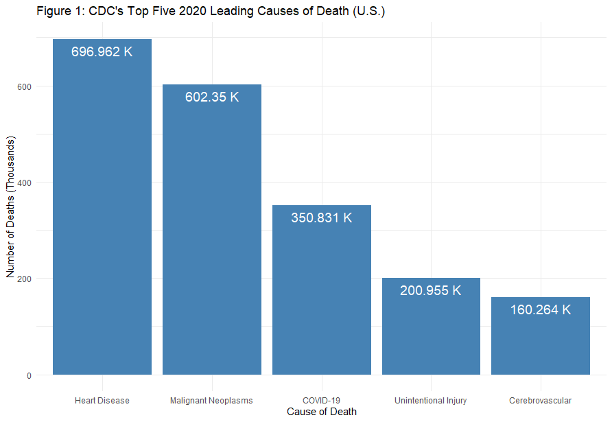

Figure 1 is the first visualization I created. I wanted to get the bare minimum which the rest of my visualizations would branch from: the 2020 leading causes of death overall. As I expected heart disease was number one. Seeing COVID as number 3 was also pretty interesting for 2020, it made me wonder where COVID would be in 2021.

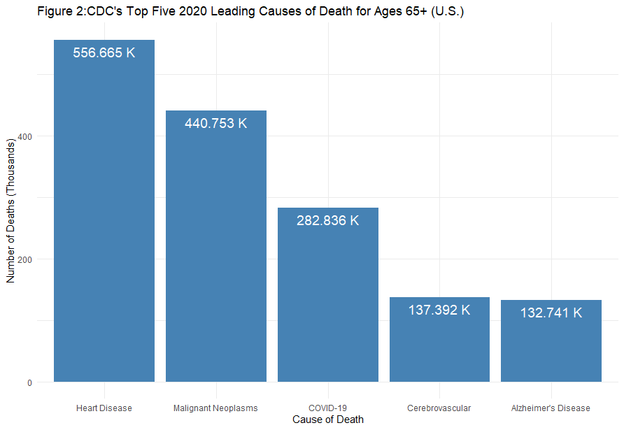

Figure 2 was my first separation into a subgroup, and I chose to use the age group 65+. As I kindof expected, they followed the trend which figure 1 created, possessing 4 of the 5 leading causes of death overall (and the first 3 being in order too).

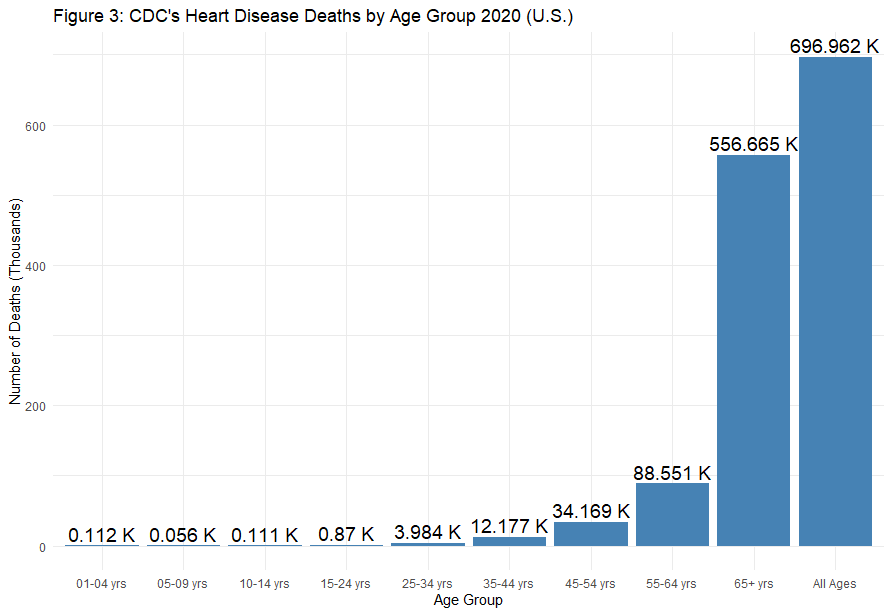

Figure 3 had me explore how heart disease squared up in all age groups individually. From figure 2, I determined that ages 65+ had a lot of heart disease deaths, which would contribute greatly to the total number seen in figure 1. This was affirmed by figure 3, where I had all my heart disease graphs side-by-side. FIgure 3 made it very evident that heart disease had way more magnitude in the older ages, with ages below 54 not having nearly the same number of deaths as 65+, but this is pretty expected since everyone 65+ has to die, whereas people in groups like 45-54 can move past that age bin.

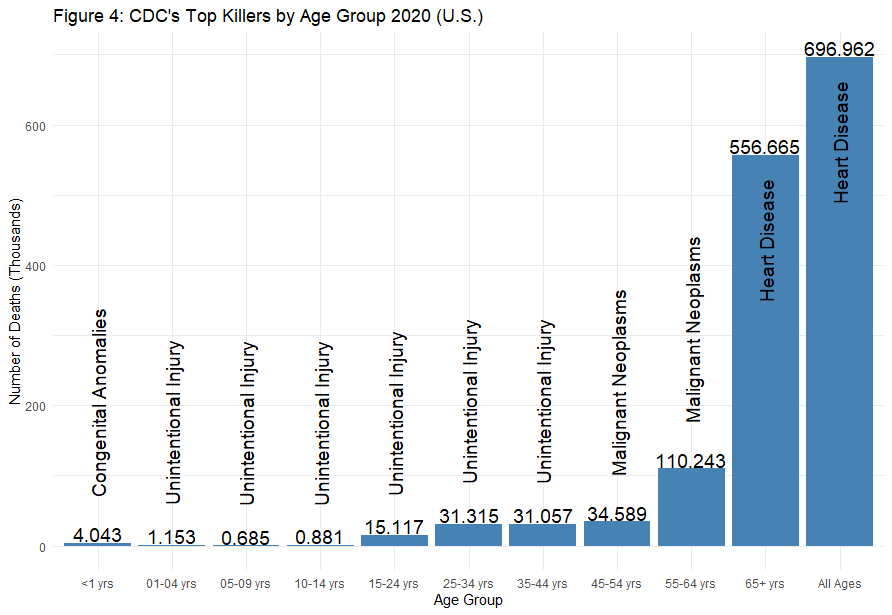

In figure 4, I decided to finally see what the top killers were for each individual age group. I discovered that despite heart disease being the top killer overall, only one age demographic had heart disease as their top killer. Instead, "unintentional injury" was the leader for ages 1-45, and by proxy, drug overdose. This affirmed what I had read in the social media post, and got me thinking about how breaking the demographics into further bins, I would likely see even more unique results whcih would have otherwise been overshadowed by the rest of the data.

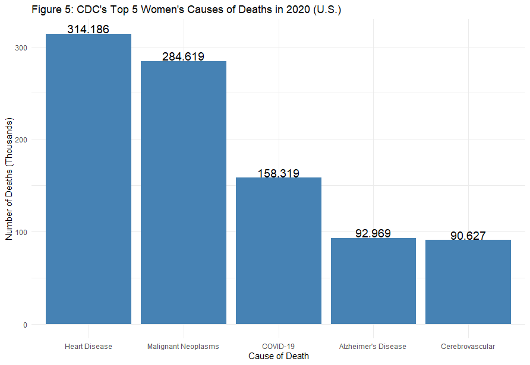

In figure 5, I decided to look at the data pertaining to women. They shared a similar bar chart to the overall cause of death in figure 1, but instead of accidental injury, the women's chart had "Alzheimer's Disease" as the 4th top cause of death.

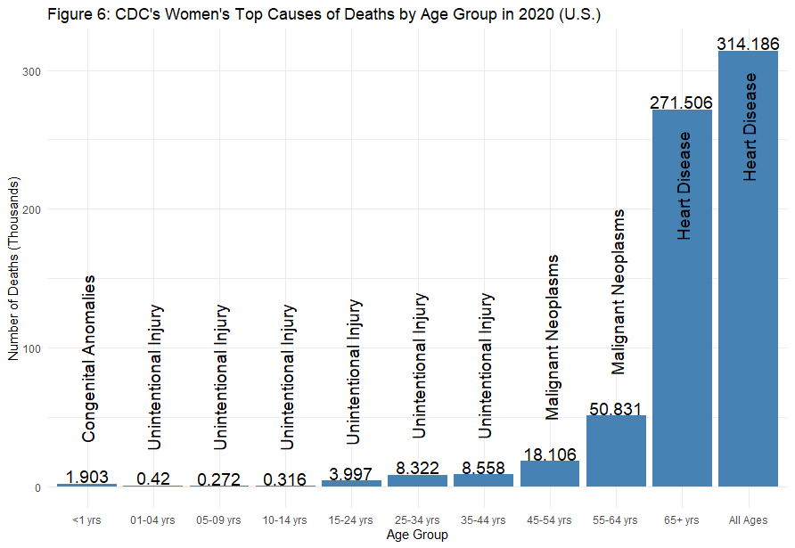

In figure 6, I once again decided to view the results in age bins, but this time just for women. It was very similar to the overall age results from figure 4.

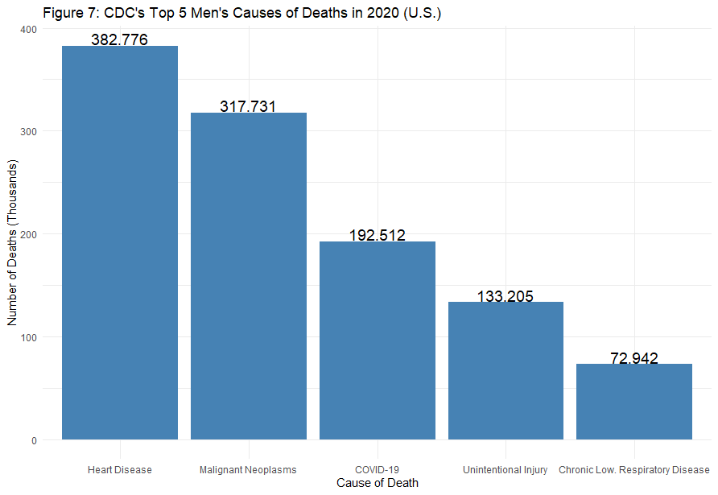

In figure 7, I decided to view the data pertaining only to men. They shared the top 4 as depicted in figure 1, but had Chronic Respiratory Disease as a fifth leading cause of death.

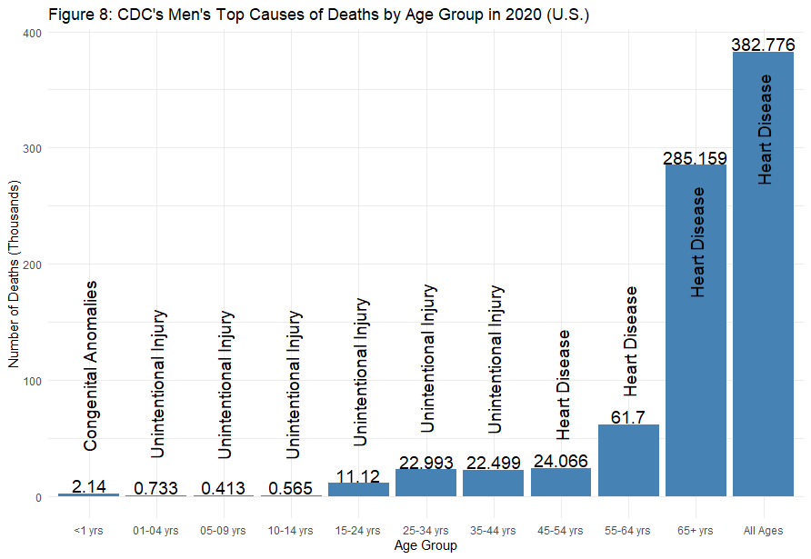

In figure 8, I broke down the men by age. I discovered that heart disease was the top cause of death from ages 45-64, which differed from how the women had malignant neoplasms, and by extension differed from the overall causes of death by age in figure 4, as those were also malignant neoplasms.

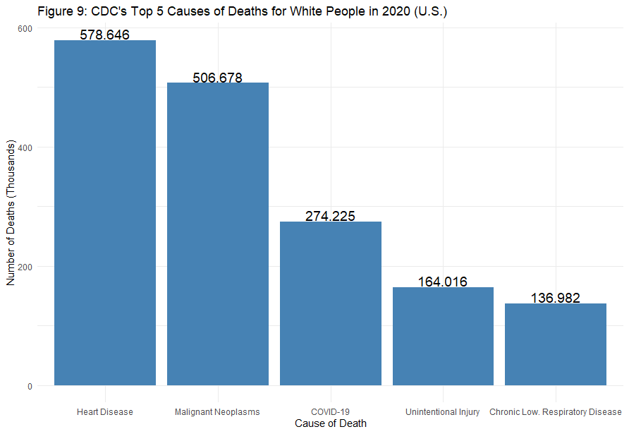

Starting in figure 9, I wanted to start looking into racial demographics, to see how those varied from the overall. Figure 9 started by looking at White people, which followed the overall pretty closely. This is likely because white people are a population plurality, so they greatly influence the overall results due to their size.

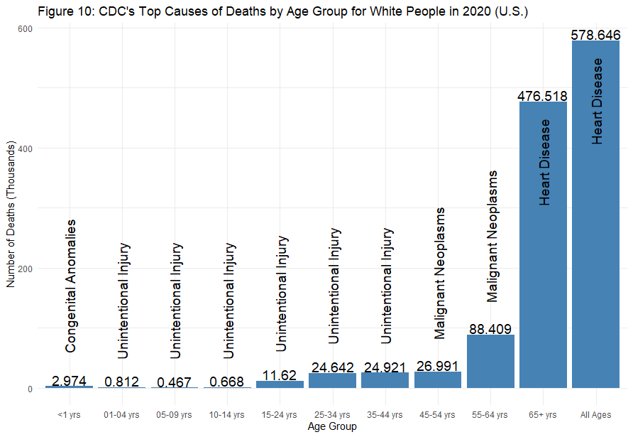

In figure 10, I broke down white people into age bins. Similar to figure 9, figure 10's results closely resemble those of the overall figures, likely due to white people being a populace plurality.

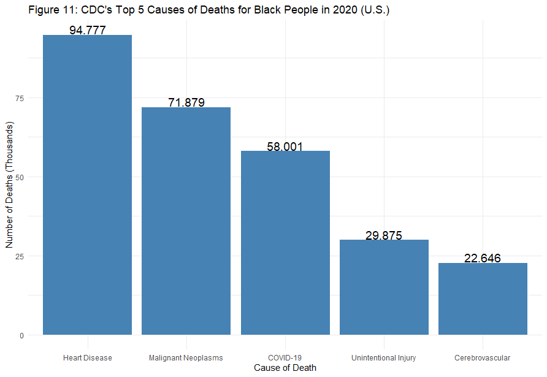

In figure 11, I looked at black people, which also closely resembled the overall in their top 5 causes of death. A difference was the 5th cause of death being 'cerebrovascular.'

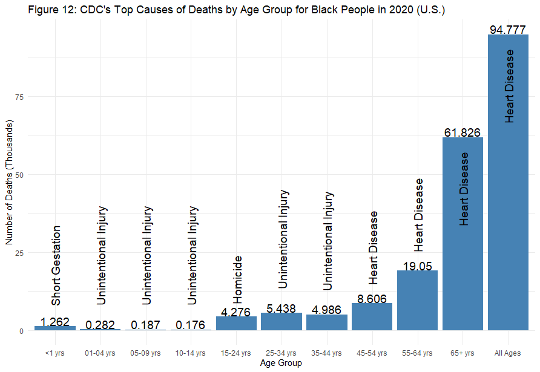

In figure 12, I broke down black people into age bins. A piece of data worth noting is in the the age bin of 15-24, which shows that the top cause of death in that bin is homicide. This was a unique discovery which surprised me, and it would have been pretty hidden had I not broke down the leading causes of death by race and age group.

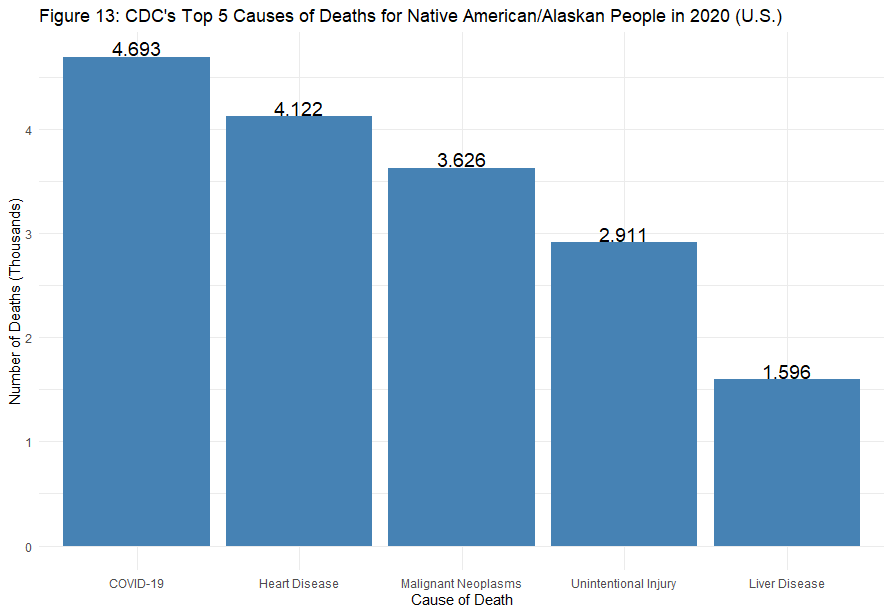

In figure 13, I looked at Native American and Native Alaskan peoples. Interestingly, their leading cause of death was COVID-19, where in other groups, this remained around 3rd place. Liver disease was also present as the fifth leading cause of death overall.

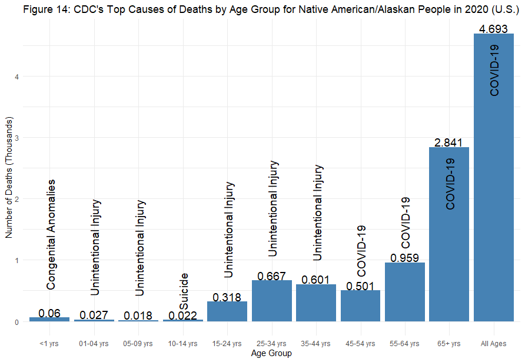

In figure 14, I once again looked at the data by age bins. Suicide was in the 10-14 age range, and COVID was affecting those older than 45. These results definitely varied from the overall results, as well as those from other age demographics.

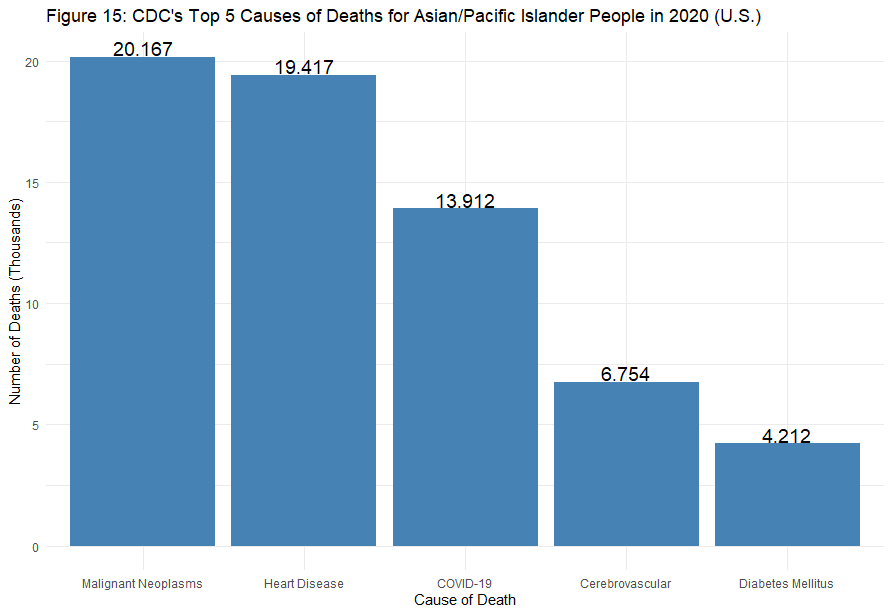

In figure 15, I viewed the Asian and Pacific Islander peoples. Heart Disease and Malignant Neoplasms swapped places, with heart disease now taking second place instead of first when looking just at this population. Diabetes was also present in their top 5 causes of death, which it had not been in the other visualizations.

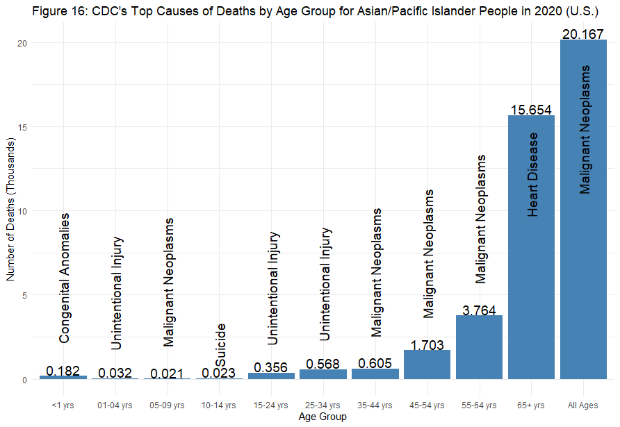

Figure 16 was my final graph, and looked at the Asian and Pacific Islander peoples by age bins. Similar to the Native Americans' figure 14, suicide stood out in the 10-14 age range. While heart disease was the leading cause of death for those older than 65, malignant neoplasms was still the most lethal overall, being prominent from ages 35 to 64, and even in ages 5-9, but the 5-9 range was only of 21 people, so that number didn't contribute much to the total malignant neoplasms of 20,000+.

## Conclusion

Final summary of the data and what you found during this project.

## Sources

In addition to using the CDC as my data source, I used a few sources to better understand how to plot using bar charts in R:

[To create better labels and to make bar charts in R's ggplots](http://www.sthda.com/english/wiki/ggplot2-barplots-quick-start-guide-r-software-and-data-visualization)

[Sorting a graph by greatest to least](https://sebastiansauer.github.io/ordering-bars/)
